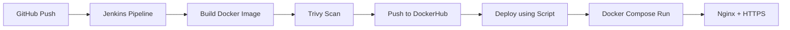

<p align="center">
  
</p>

<h1 align="center">🦉 NIGHTOWL — Minimal & Modern Journal Web App</h1>

<p align="center">
A beautiful, distraction-free journal application designed for night thinkers.  
Built using Next.js, Clerk, Prisma ORM, TailwindCSS & Arcjet Security.
</p>

---

## 🌐 Live Demo  
✨ Explore the app here: https://nightowl-journal.vercel.app/

---

## 🧩 Features

- 📝 Rich Text Editor (React Quill)
- 📁 Create & manage collections
- 🔐 Clerk authentication (secure login)
- 🌙 Minimal, night-friendly UI
- ⚡ Next.js App Router performance
- 🛡 Arcjet protection for API routes
- 🗃 Data managed using Prisma ORM

---


## 🛠️ Tech Stack

### **Frontend**
<p align="center">
  
  
  
</p>

### **Authentication**
<p align="center">
  
</p>

### **Database & ORM**
<p align="center">
  
  
</p>

### **Security**
<p align="center">
  
</p>


---


# ⚙️ DevOps Implementation (Production Setup)

This project is deployed using a complete DevOps pipeline with automation, security, and production-grade configuration.

---

## 🚀 CI/CD Pipeline (Jenkins)

* Integrated **GitHub Webhooks** to automatically trigger builds
* Designed a **multi-stage Jenkins pipeline**:

  * Code checkout
  * Docker image build
  * Security scanning using Trivy
  * Push to DockerHub
  * Automated deployment

---

## 🐳 Containerization

* Application containerized using **Docker (multi-stage build)**
* Managed multi-container setup using **Docker Compose**:

  * App container
  * PostgreSQL database

---

## 🔄 Automated Deployment

* Created custom **`deploy.sh` script** for:

  * Pull latest code
  * Rebuild Docker images
  * Restart containers
  * Perform health checks

---

## 🛡️ Security (DevSecOps)

* Integrated **Trivy** for container vulnerability scanning
* Ensured only secure images are deployed in production

---

## 🌐 Reverse Proxy & HTTPS

* Configured **Nginx as reverse proxy**

* Connected custom domain:
  👉 https://app.dealgo.food

* Enabled **HTTPS using Let's Encrypt SSL**

* Implemented secure traffic routing

---

## ❤️ Health Check & Reliability

* Implemented **application health check using curl**
* Ensured container reliability using restart policies

---

## 📊 Logging

* Used **Docker logs** for debugging and monitoring
* Enabled basic logging for deployment tracking

---

## 🧠 DevOps Workflow



---

## 💼 DevOps Highlights

* End-to-end **CI/CD pipeline implementation**
* Real-world **production deployment with domain & SSL**
* **DevSecOps integration** with Trivy
* Automated deployment using **shell scripting**
* Container orchestration using **Docker Compose**
  
---

## 📸 Screenshots

### 🏠 Home Page  


---

### ✍️ Text Editor Page  


---

### 📚 Collections Page  


---

## 📦 Installation & Setup

### **1️⃣ Clone the repository**
```bash
git clone https://github.com/krishnapschauhan/nightowl-journal-app.git
cd nightowl-journal-app
```

---

### **2️⃣ Install dependencies**
run this command all dependence install in one click
```
chmod 754 install.sh
```
```
./install.sh
```

---

### **3️⃣ Setup environment variables**
copy `.env.local` in the root:

```
cp env.local .env
```

---
### **4️⃣ docker compose up**

```
docker compose up -d --build
```
---


Open → http://localhost:3000

---


---


## 🤝 Contributing
Contributions are welcome!  
Feel free to open issues or submit pull requests.

---

## 📝 License
This project is licensed under the **MIT License**.

---

<p align="center">
  
</p>

<p align="center">✨ Built with passion by Krishna ✨</p>
